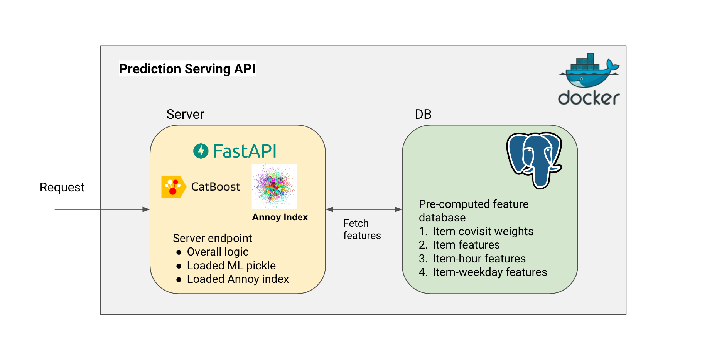
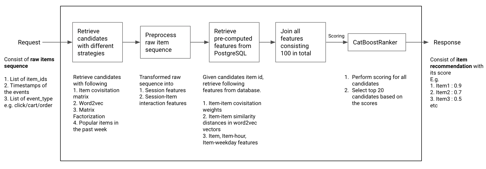

# kaggle-otto-multi-objective-recsys-serving

How would I build serving API for model trained for [OTTO - Multi-Objective Recommender System](https://www.kaggle.com/competitions/otto-recommender-system) competition?
## Context

> Online shoppers have their pick of millions of products from large retailers. While such variety may be impressive, having so many options to explore can be overwhelming, resulting in shoppers leaving with empty carts. This neither benefits shoppers seeking to make a purchase nor retailers that missed out on sales. This is one reason online retailers rely on recommender systems to guide shoppers to products that best match their interests and motivations. Using data science to enhance retailers' ability to **predict which products each customer actually wants to see, add to their cart, and order at any given moment of their visit in real-time could improve your customer experience** the next time you shop online with your favorite retailer.

We need to make inference in **real-time** as customer shopping which translates to requirements

1. Take input real-time sequence of customer activities (described by list of items clicked/added-to-cart/ordered with its timestamp)
2. Return list of recommended items for customer (optimized either for click/add-to-cart/order)
3. As customer's shopping time could be really fast, the system should have low-latency response

## System Design



## API Spec

Following are example of valid request and its response

### Request

```json
{
    "aids": [
        429240,
        588903,
        170046,
        429240,
        170046
    ],
    "timestamps": [
        1674210000,
        1674220000,
        1674830000,
        1674832100,
        1674832437
    ],
    "event_types": [
        0,
        1,
        1,
        1,
        2
    ]
}
```

### Response

```json
{
    "status": "success",
    "recommendation": [
        429240,
        588903,
        170046,
        597886,
        1180285,
        128763
    ],
    "scores": [
        6.137368148153008,
        5.465248549680262,
        4.310939557989943,
        1.8090619451704857,
        1.7002370097088992,
        0.7901096152820789
    ],
}
```

## Prediction Steps



## Development

The service require Docker installed in your machine

```bash
# build docker images
docker-compose build

# fire up the container
docker-compose up -d

# check logs for web service
docker-compose logs web
# at this point, if the Application startup complete successfully,
# before sending request to endpoint, you need to export sample pre-computed features to the postgres db

# we may do load-testing using locustfile in project/tests/load-test/locustfile.py

```

Steps for setting up database could be found in [project/db/README.md](project/db/README.md)
